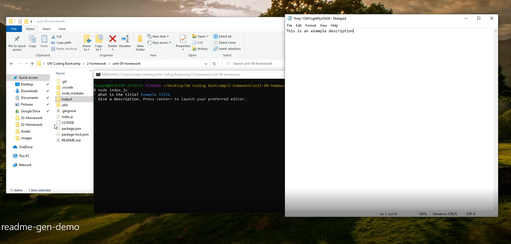

# Readme Generator
  

## Description

This is a simple command line program using Inquirer to get information about the readme from the user in order to generate a basic README for any project. The program is written using javascript and executed using Node.

Demo of the program at https://drive.google.com/file/d/1UVDFqL3VmAcPGnwhKXp2FXKHHHCR7l2k/view

## Table of Contents

- [Installation](#installation)
- [Usage](#usage)
- [Contributing](#contributing)
- [Tests](#tests)
- [License](#license)
- [Questions](#questions)

## Installation
- First clone the repo
- Install Node if not already installed
- Use npm to get dependencies installed

## Usage
The program is executed from the command line using the command "node index.js". Once all inputs have been provided the resulting README.md file will be generated in the output folder included in the repo.

## Contributing
Currently this project is considered completed and I am not looking to update or expand it.

## Tests
There is no automated testing for this code at this time.

## License
Licensed under the MIT License  
https://opensource.org/licenses/MIT

## Questions
If you have any other questions you can find me on github at [j92pruitt](https://www.github.com/j92pruitt) or email me at j92pruitt@gmail.com.
